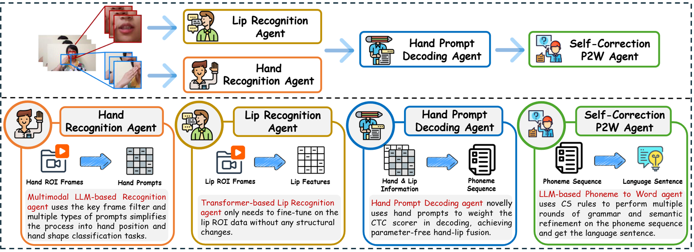
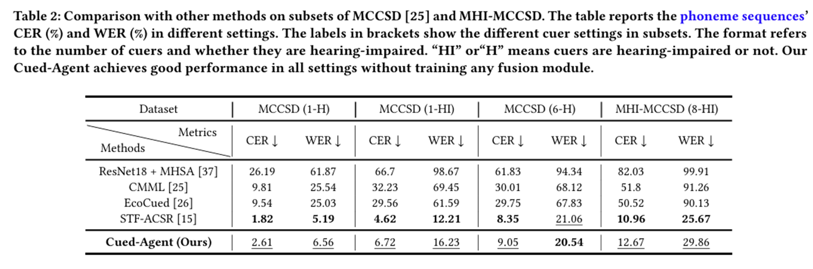
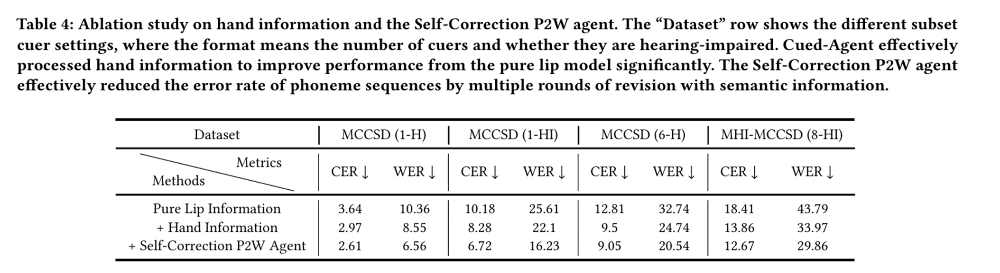

# Cued-Agent: A Multi-Agent Framework for Automatic Cued Speech Recognition

[](LICENSE)
[](https://www.python.org/)
[](https://pytorch.org/)
[](https://arxiv.org/abs/2508.00391)
[](https://dennishgj.github.io/)

Cued-Agent is the first multi-agent system for automatic Cued Speech
recognition. It integrates visual lip reading, training-free hand cue
recognition and prompt decoding, and LLM self-correction. The work was accepted
by ACM Multimedia 2025.

Visit [Guanjie Huang's homepage](https://dennishgj.github.io/) for publications,
projects, and contact information. See [CHANGELOG.md](CHANGELOG.md) for the
repository's maintenance and validation history.



## Architecture and training boundary

The runtime consists of four stages:

1. The Lip Recognition Agent extracts lip ROIs and encodes visual speech.
2. The Hand Recognition Agent identifies one hand position and shape per
   slow-motion group.
3. The Hand Prompt Decoding Agent aligns hand cues to video frames and adds
   `4.5 * H` to the CTC scores during joint CTC/attention beam search.
4. The optional P2W Agent corrects the decoded phonemes and produces pinyin and
   Mandarin.

Only the lip model and its sequence decoder are trained in this repository:

| Component | Trained here | Training input |
| --- | --- | --- |
| Lip visual encoder | Yes | Lip ROI frames |
| CTC head and attention decoder | Yes, jointly with the lip encoder | Phoneme labels |
| MLLM Hand Recognition Agent | No | Prompting and a visual support set |
| Hand Prompt Decoding Agent | No added parameters | Inference-time CTC prompt |
| Self-Correction P2W Agent | No | LLM prompting |

“Decoder training” therefore means the attention decoder and CTC projection are
trained with the lip encoder. Hand prompt fusion reuses the trained model and
does not require hand labels during training.

## Repository layout

```text
cued_agent/                              maintained inference package
hand_recognition_agent/                  OpenAI vision prompt and support set
lip_agent_and_prompt_decoding_agent/     lip/decoder model, training, ESPnet code
self-p2w-agent/                          legacy experiment scripts
util/                                    ROI preprocessing helpers
tests/                                   repository-owned unit and CLI tests
CHANGELOG.md                             repository maintenance history
run_inference.py                         single-video CLI
batch_inference.py                       batch CLI
Inference.py                             backward-compatible import
```

## Installation

Python 3.8-3.11 and an NVIDIA GPU are supported for inference. The original
server environment (`auto_avsr`, Python 3.8) is part of release validation;
Python 3.10 or 3.11 is recommended for a new environment.

The training entry point translates trainer defaults between PyTorch Lightning
1.5 and 2.x, so the original environment and newly created environments use the
same command.

```bash
python -m venv .venv
# Linux/macOS: source .venv/bin/activate
# Windows: .venv\Scripts\activate
python -m pip install --upgrade pip
python -m pip install -r requirements.txt
```

Install the PyTorch build appropriate for your CUDA version when the default pip
build is unsuitable. Copy the variables from `.env.example` into your shell;
secrets are never stored in source.

The public repository does not distribute the research dataset or a trained
checkpoint. See `ckpt/README.md` for the checkpoint contract.

## End-to-end inference

Full four-stage inference requires `OPENAI_API_KEY`, `DEEPSEEK_API_KEY`, and
a fine-tuned lip/decoder checkpoint:

```bash
python run_inference.py \
  --video HS-0001.mp4 \
  --checkpoint ckpt/lip_decoder.ckpt \
  --output outputs/HS-0001.json
```

Paper defaults are used automatically: hand prompt weight `4.5`, joint beam
search CTC weight `0.5`, and beam size `20`.

Current API defaults use `gpt-4.1` with high-detail image inputs for hand
recognition and `deepseek-v4-pro` with JSON Output for P2W. Override
`OPENAI_HAND_MODEL`, `OPENAI_IMAGE_DETAIL`, `DEEPSEEK_MODEL`, or
`DEEPSEEK_MAX_TOKENS` when a different provider model is required. For a
paper-era comparison, `OPENAI_HAND_MODEL=gpt-4o-2024-08-06` can be selected only
while that deprecated snapshot remains available to the account.

Use saved hand labels for reproducible, API-free prompt fusion:

```bash
python run_inference.py \
  --video HS-0001.mp4 \
  --checkpoint ckpt/lip_decoder.ckpt \
  --hand-results path/to/hand_results.json \
  --no-self-correction
```

Run a pure-lip ablation with no external API calls:

```bash
python run_inference.py \
  --video HS-0001.mp4 \
  --checkpoint ckpt/lip_decoder.ckpt \
  --lip-only \
  --no-self-correction
```

See [README_INFERENCE.md](README_INFERENCE.md) for stage contracts, hand-result
format, outputs, and common failures.

## Train the lip encoder and decoder

The label loader accepts either four CSV fields for lip training
(`dataset,video,input_length,token_ids`) or the legacy six-field hand
evaluation rows. Hand fields are ignored when `include_hand=false`.

```bash
cd lip_agent_and_prompt_decoding_agent
python train_lip_agent.py \
  data.dataset.root_dir=/path/to/dataset \
  data.dataset.label_dir=labels \
  data.dataset.train_file=train.csv \
  data.dataset.val_file=val.csv \
  pretrained_model_path=/path/to/base_visual_model.pth \
  exp_dir=../exp \
  exp_name=lip_decoder
```

This jointly trains the visual encoder, CTC projection, and attention decoder.
It does not initialize audio augmentation or load hand-recognition data in
video-only mode.

## Validation

Fast tests do not require API keys or model weights:

```bash
python -m unittest discover -s tests -v
```

Release 1.1.0 was validated on the original research server with Python 3.8.20,
PyTorch 2.0.1+cu117, PyTorch Lightning 1.5.10, and an RTX A6000:

- all 18 repository tests and Python 3.8 compilation passed, including raw
  OpenAI 1.88 SDK request/response contracts against in-memory HTTP transports;
- pure-lip inference completed on `HS-0001.mp4` with the 2.87 GB
  `H_multi_lip.ckpt`;
- offline hand-prompt fusion completed with 8 detected slow-motion groups;
- one real CCS training batch and one validation batch completed after loading
  762/767 compatible tensors from the base visual checkpoint.

The isolated training server cannot call external LLM APIs. Live hand
recognition and P2W therefore require a networked host; failures are surfaced
rather than replaced with fabricated labels.

## Results





## Citation

```bibtex
@inproceedings{10.1145/3746027.3755423,
  author = {Huang, Guanjie and Tsang, Danny H.K. and Yang, Shan and Lei, Guangzhi and Liu, Li},
  title = {Cued-Agent: A Collaborative Multi-Agent System for Automatic Cued Speech Recognition},
  year = {2025},
  publisher = {Association for Computing Machinery},
  url = {https://doi.org/10.1145/3746027.3755423},
  doi = {10.1145/3746027.3755423},
  booktitle = {Proceedings of the 33rd ACM International Conference on Multimedia},
  pages = {8313--8321},
  location = {Dublin, Ireland},
  series = {MM '25}
}
```

## License and contact

This project is licensed under the [MIT License](LICENSE). Open a GitHub issue,
visit [Guanjie Huang's homepage](https://dennishgj.github.io/), or contact
`ghuang565@connect.hkust-gz.edu.cn` for questions and collaboration.
